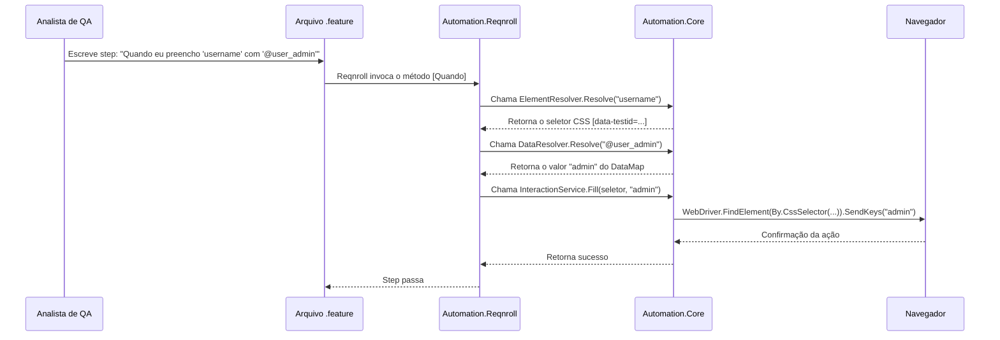

# 01 - Visão Geral da Arquitetura

Este documento detalha a arquitetura da Automation Platform, seus componentes principais e o fluxo de dados desde o Gherkin até a interação com o navegador.

---

## 🏗️ Componentes Principais

A plataforma é composta por três projetos C# distintos, cada um com uma responsabilidade clara:

| Projeto | Responsabilidade | Consumidor Principal |
|---|---|---|
| `Automation.Core` | **Motor de Resolução e Interação.** Contém a lógica de negócio para interpretar contratos, gerenciar o WebDriver e interagir com elementos. | `Automation.Reqnroll` |
| `Automation.Reqnroll` | **Camada de Steps Gherkin.** Mapeia os passos Gherkin para chamadas de serviço no `Automation.Core`. | Analistas de QA |
| `Automation.Validator` | **Ferramenta CLI de Validação.** Valida a sintaxe e a integridade dos contratos (UiMap, DataMap, Gherkin) em tempo de design ou CI/CD. | Desenvolvedores e CI/CD |

Esta separação garante que a lógica de negócio (`Core`) seja independente do framework de BDD (`Reqnroll`) e das ferramentas de validação (`Validator`).

---

## 🌊 Fluxo de Execução de um Teste

O diagrama abaixo ilustra o fluxo de dados e interações quando um step Gherkin é executado.

### Detalhamento do Fluxo:

1.  **Parsing do Gherkin:** O Reqnroll (framework BDD) lê o arquivo `.feature` e identifica o step a ser executado.
2.  **Mapeamento do Step:** O Reqnroll encontra o método C# correspondente no projeto `Automation.Reqnroll` (ex: `InteractionSteps.QuandoEuPreenchoCom`).
3.  **Resolução de Elemento:** O step chama o `ElementResolver` no `Automation.Core`. Ele usa o `PageContext` para saber a página atual e consulta o `UiMap` para encontrar o seletor CSS do elemento (`username`).
4.  **Resolução de Dados:** O step chama o `DataResolver` no `Automation.Core`. Ele interpreta o prefixo `@` e busca o objeto `user_admin` no `DataMap`, retornando o valor do campo correspondente.
5.  **Interação:** O step chama um serviço de interação (ex: `InteractionService`) no `Automation.Core`, passando o seletor e o valor resolvido.
6.  **Ação do WebDriver:** O serviço de interação usa a instância do `WebDriver` para encontrar o elemento no navegador e executar a ação (`SendKeys`).
7.  **Retorno:** O resultado da operação é propagado de volta até o Reqnroll, que marca o step como "passou" ou "falhou".

---

## 💡 Princípios de Design Aplicados

*   **Single Responsibility Principle (SRP):** Cada classe e projeto tem uma única responsabilidade. `DataResolver` só resolve dados, `ElementResolver` só resolve elementos.
*   **Dependency Inversion Principle (DIP):** A camada de `Reqnroll` depende de abstrações (interfaces de serviço) do `Core`, não de implementações concretas. Isso permite a substituição de serviços e facilita testes unitários.
*   **Declarative Approach:** Os QAs *declaram* a intenção nos arquivos YAML. O `Core` é responsável pela implementação *imperativa* de como realizar essa intenção. Isso isola os QAs da complexidade do Selenium/WebDriver.
*   **Shift-Left by Design:** O `Automation.Validator` é um cidadão de primeira classe na arquitetura. Ele permite que a validação de contratos ocorra muito antes da execução dos testes, economizando tempo e recursos de CI/CD.

---

## 🚀 Inovações Recentes

### Anchor Pattern
-   **Problema:** Em SPAs, a URL nem sempre muda durante a navegação, tornando a identificação de página ambígua.
-   **Solução:** O campo `anchor` no `UiMap` define um elemento único que **deve** estar presente para que a página seja considerada carregada. O `PageContext` agora valida ativamente esse anchor após a navegação.

### Sintaxe Explícita do DataResolver
-   **Problema:** Ambiguidade entre um valor literal (ex: a string `"user_admin"`) e uma referência a um objeto de dados (`user_admin`).
-   **Solução:** Introdução de prefixos determinísticos (`@`, `{{}}`, `${}`) que removem qualquer ambiguidade. A ausência de prefixo **sempre** significa um valor literal.

Essas duas melhorias aumentaram drasticamente o determinismo e a robustez da plataforma.

---

**Próximo Documento:** [02 - Estrutura dos Projetos](02-PROJECT-STRUCTURE.md)
